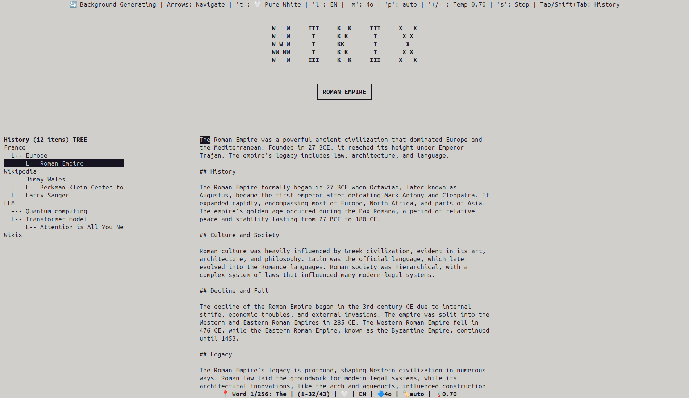

# Wikix



Wikix is a small toolkit to generate short encyclopedic entries ("fiches") from a given subject using LLM providers. It includes:

- A CLI for one-shot generation and context-linked generation
- A simple TUI for keyboard-driven browsing and background generation

## Requirements

- Python 3.12+
- One LLM provider API key (at least one of OpenAI, Google Gemini, Cerebras, or OpenRouter)

## Installation

```bash
git clone https://github.com/sbstndb/wikix.git
cd wikix
python -m venv .venv && source .venv/bin/activate
pip install -r requirements.txt

# Optional: install the package to get the `wikix` command
pip install -e .
```

## API Keys and Models (Important)

Wikix supports multiple providers. Set the environment variables below (directly in your shell or in a `.env` file at the project root – python-dotenv is auto-loaded).

- OpenAI
  - `OPENAI_API_KEY` (required to use OpenAI)
  - Optional: `OPENAI_MODEL` (default: `gpt-4o-mini`)
- Google Gemini
  - `GEMINI_API_KEY`
  - Optional: `GEMINI_MODEL` (default: `gemini-2.5-flash`)
- Cerebras (via Cloudflare AI Gateway)
  - `CEREBRAS_API_KEY`
  - Optional: `CEREBRAS_MODEL` (default: `llama3.1-8b`)
- OpenRouter
  - `OPENROUTER_API_KEY`
  - Optional: `OPENROUTER_MODEL` (default: `openai/gpt-oss-120b`)

Networking

- `LLM_HTTP_TIMEOUT_S` (default: `60`) — HTTP timeout used by non-OpenAI providers

Provider selection logic

- If you pass a `--provider` explicitly (one of `openai`, `gemini`, `cerebras`, `openrouter`), Wikix uses that provider.
- Otherwise, Wikix tries to infer the provider from the model prefix (e.g., `anthropic/…` → OpenRouter, `gemini-…` → Gemini, `llama…` → Cerebras, `gpt-…`/`o3`/`o4` → OpenAI).
- If neither `--provider` nor `--model` is given, Wikix defaults to OpenAI with `OPENAI_MODEL` or `gpt-4o-mini`. In that case, `OPENAI_API_KEY` must be set.

Example `.env`:

```env
# Choose one provider (you can keep others for later)
OPENAI_API_KEY=sk-...
# OPENAI_MODEL=gpt-4o-mini

# GEMINI_API_KEY=...
# GEMINI_MODEL=gemini-2.5-flash

# CEREBRAS_API_KEY=...
# CEREBRAS_MODEL=llama3.1-8b

# OPENROUTER_API_KEY=...
# OPENROUTER_MODEL=openai/gpt-oss-120b

# Optional network tuning
# LLM_HTTP_TIMEOUT_S=60
```

## CLI Usage

You can run the CLI either as a module or via the installed entry point:

```bash
# If installed with `pip install -e .`
wikix generate "Lyon"

# Or directly without installing the package
python -m wikix generate "Lyon"
```

Commands:

- `generate <subject>`: generate a simple fiche
- `link <subject> --context <generated/some_subject.md>`: generate a fiche using an existing fiche as context
- `list`: list generated fiches in the `generated/` folder
- `show <fiche-name>`: display the content of a previously generated fiche
- `interactive` or `tui`: launch the TUI (note: running `wikix` with no arguments launches the TUI by default)

Common options for `generate` and `link`:

- `--model` e.g. `gpt-4o-mini`, `gemini-2.5-flash`, `llama3.1-8b`, `anthropic/claude-3.5-sonnet`
- `--provider` one of `openai`, `gemini`, `cerebras`, `openrouter` (optional; can be inferred from model)
- `--temperature` float in `[0.0, 1.0]` (note: some OpenAI models ignore non-1.0 temps)
- `--lang` one of `fr`, `en`, `es` (selects the prompt template language)
- `--output` path to file or directory (defaults to `generated/<slugified-subject>.md`)

Examples:

```bash
# Generate in French using OpenAI default
wikix generate "São Paulo"

# Generate in English with Gemini (inferred by model name)
wikix generate "Rhône" --lang en --model gemini-2.5-flash

# Generate with an explicit provider (OpenRouter) and model
wikix generate "Microwave oven" --lang en --provider openrouter --model anthropic/claude-3.5-sonnet

# Context-linked generation (reads an existing fiche)
wikix link "Rhône" --context generated/lyon.md --lang en --temperature 0.6 --show
```

## TUI

Launch the TUI to browse text, generate new subjects, and keep a tree-like history.

```bash
# Default (no arguments): launches the TUI
wikix

# Launch the TUI with an initial subject directly
wikix "Wikipedia"

# Explicit subcommands
wikix tui "Wikipedia"
wikix interactive
```

Hints:

- Enter: generate from the current or selected word
- Arrows/PageUp/PageDown/Home/End: navigate words and scroll
- Space: toggle selection; Enter to generate from selection
- t/l/m/p: cycle Theme/Language/Model/Provider
- h: toggle history panel; q: quit

## Templates and Output

- Prompt templates are in `prompts/` with 3 languages: `fr`, `en`, `es`.
- Output files are written to `generated/` with a slugified filename based on the subject.

## Troubleshooting

- Missing API key: you will get a clear error like "La clé d'API OpenAI est requise..."
  - Fix: set the relevant environment variable(s) or `.env` entries as described above
- Provider not found for model: ensure your model name matches the provider (or set `--provider`)
- Some OpenAI models (o3/o4/gpt-5) ignore non-1.0 temperatures; this is expected
- Timeouts: adjust `LLM_HTTP_TIMEOUT_S` for non-OpenAI HTTP clients

## License

This project is released under the MIT License. See `LICENSE` for the full text.
